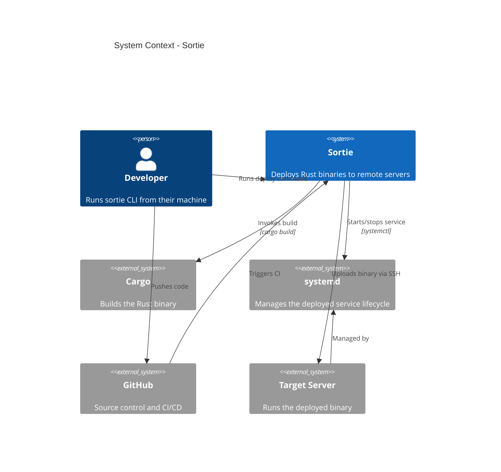
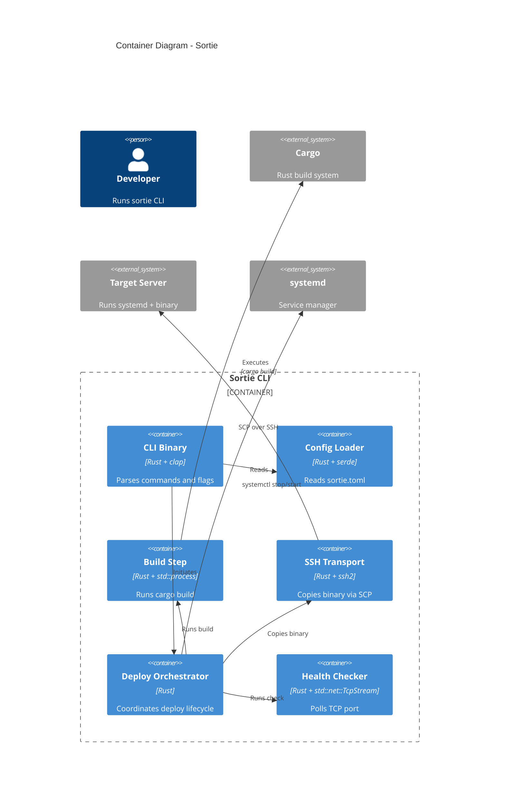

# C4 Architecture Diagrams

## System Context (Level 1)



## Container Diagram (Level 2)



## Component Diagram (Level 3)

```mermaid
C4Component
  title Component Diagram - Sortie CLI Binary

  Container_Boundary(sortie, "Sortie CLI") {
    Component(cli, "CLI Parser", "clap", "Parses subcommands and flags")
    Component(config, "Config", "serde + TOML", "Loads sortie.toml")
    Component(builder, "Builder", "std::process::Command", "Runs cargo build")
    Component(ssh, "SSH Client", "ssh2", "SCP upload + remote commands")
    Component(deployer, "Deployer", "Rust", "Orchestrates the deploy lifecycle")
    Component(health, "Health Checker", "std::net::TcpStream", "TCP port polling")
    Component(rollback, "Rollback", "Rust", "Restores previous binary version")
  }

  Rel(cli, deployer, "Initiates deploy")
  Rel(deployer, config, "Reads config")
  Rel(deployer, builder, "Runs build")
  Rel(deployer, ssh, "Uploads binary")
  Rel(deployer, health, "Runs check")
  Rel(deployer, rollback, "Triggers on failure")
  Rel(health, server, "TCP connect", ":8080")
  Rel(ssh, server, "SCP + commands", "SSH")
```

## Dynamic Diagram (Deploy Flow)

```mermaid
C4Dynamic
  title Dynamic Diagram - Deploy Production

  Person(dev, "Developer", "Runs sortie deploy production")

  Container_Boundary(sortie, "Sortie CLI") {
    Component(cli, "CLI Parser", "clap")
    Component(deployer, "Deployer", "Rust")
    Component(builder, "Builder", "std::process")
    Component(ssh, "SSH Client", "ssh2")
    Component(health, "Health Checker", "TcpStream")
    Component(rollback, "Rollback", "Rust")
  }

  System_Ext(cargo, "Cargo")
  System_Ext(server, "Target Server")
  System_Ext(systemd, "systemd")

  Rel(cli, deployer, "1. sortie deploy production")
  Rel(deployer, config, "2. Read sortie.toml")
  Rel(deployer, builder, "3. Build binary")
  Rel(builder, cargo, "4. cargo build --release")
  Rel(deployer, ssh, "5. Upload binary")
  Rel(ssh, server, "6. SCP binary", "SSH port 22")
  Rel(deployer, ssh, "7. systemctl stop sortie")
  Rel(ssh, server, "8. Stop service")
  Rel(deployer, ssh, "9. Copy binary to /opt/sortie")
  Rel(deployer, health, "10. Health check")
  Rel(health, server, "11. TCP :8080")
  alt Health passes
    Rel(deployer, ssh, "12. systemctl start sortie")
  else Health fails
    Rel(deployer, rollback, "12. Restore previous binary")
    Rel(rollback, ssh, "13. Copy backup")
  end
```
